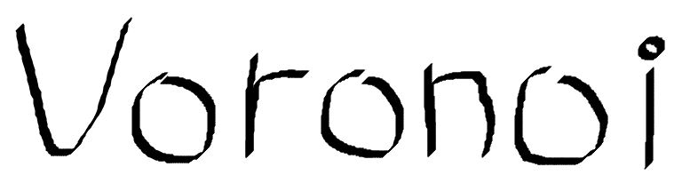

## < 보로노이 >

### 파이썬을 이용한 보로노이 다이어그램 (feat. Soccer)

**- 보로노이란?**

`보로노이 다이어그램`은 평면을 특정 점까지의 거리가 가장 가까운 점의 집합으로 분할한 그림이다.

**- 모듈 세팅**

`pip install image` 명령을 통해 image 모듈을 설치

└ 파이썬 3.* 버전의 경우 `pip3 install image` 명령 입력

**- 설명**

특정 좌표를 직접 지정해주고, 보로노이 알고리즘을 이용한 축구포지션을 만들어 보겠습니다.

**- 코딩**

이미지파일을 만들기위해(`putpixel`) Image. PIL을 가져옵니다.

빗변을 구하는 `hypot`을 사용하기위해 math를 가져오고

랜덤 색깔을 받아오기위해(`*.randrange()`) random 모듈을 사용합니다.

 

  

